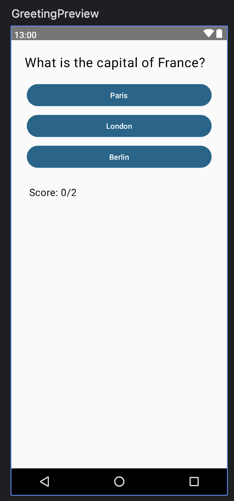

# QuizApp
Starter Solution for Quiz App

## Preview

## Test Cases
* Test Quiz Initialization:
-[ ] Verify that the quiz starts with the first question.
-[ ] Check that the score is initially zero.

Test Displayed Question:
Ensure that the current question is displayed correctly.
Check that the Text composable is showing the right question text.

Test Displayed Answer Choices:
Confirm that the answer choices are displayed correctly.
Check that Button composables display the correct answer options for the current question.

Test Answer Selection:
Simulate a user selecting an answer.
Verify that the selected answer choice is visually marked.

Test Correct Answer:
Simulate a user selecting the correct answer.
Confirm that the app provides positive feedback for a correct choice.

Test Incorrect Answer:
Simulate a user selecting an incorrect answer.
Ensure the app provides appropriate feedback for an incorrect choice.

Test User Score Increment:
Verify that the user's score increases when they select the correct answer.

Test User Score No Change:
Confirm that the user's score remains unchanged when they select the wrong answer.

Test Progress to Next Question:
Simulate the user advancing to the next question.
Verify that the app displays the next question and answer choices.

Test Quiz Completion:
Advance through all questions.
Check that the app displays the user's final score.

Test Restart Quiz:
Restart the quiz after completing it.
Ensure that the app resets the quiz to the first question and resets the score.

Test Image Display:
Check that image composable displays relevant images, if used.

Test Handling of Quiz Data:
Ensure the app handles empty or null quiz data gracefully.

Test User Interaction with Buttons:
Confirm that buttons respond to click events correctly.

Test Timer (if implemented):
If you've added a timer, test that it counts down correctly and handles time-out scenarios.
